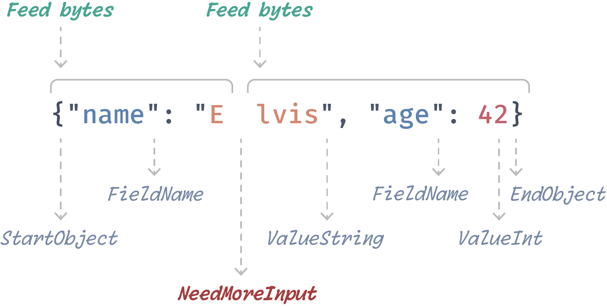

# Actson [](https://github.com/michel-kraemer/actson-rs/actions) [](LICENSE) [](https://crates.io/crates/actson) [](https://docs.rs/actson/latest/actson/)

Actson is a low-level JSON parser for reactive applications and non-blocking I/O. It is event-based and can be used in asynchronous code (for
example in combination with [Tokio](https://tokio.rs/)).

<div align="center">
  <br>
  <br>
  
  <br>
  <br>
  <br>
</div>

## Why another JSON parser?

* **Non-blocking.** Reactive applications should use non-blocking I/O so that no thread needs to wait indefinitely for a shared resource to become available (see the
  [Reactive Manifesto](http://www.reactivemanifesto.org/)). Actson supports this pattern.
* **Big Data.** Actson can handle arbitrarily large JSON text without having to completely load it into memory. It is very fast and achieves constant parsing throughput (see the [Performance](#performance) section below).
* **Event-based.** Actson produces events during parsing and can be used for streaming. For example, if you write an HTTP server, you can receive a file and parse it at the same time.

Actson was primarily developed for the [GeoJSON](http://geojson.org/) support in [GeoRocket](http://georocket.io), a high-performance reactive data store for geospatial files. For this application, we needed a way to parse very large JSON files with varying contents. The files are received through an HTTP server, parsed into JSON events while they are being read from the socket, and indexed into a database at the same time. The whole process runs asynchronously.

If this use case sounds familiar, then Actson might be a good solution for you. Read more about its [performance](#performance) and how it [compares to Serde JSON](#should-i-use-actson-or-serde-json) below.

## Usage

### Push-based parsing

Push-based parsing is the most flexible way of using Actson. Push new bytes
into a `PushJsonFeeder` and then let the parser consume them until it returns
`Some(JsonEvent::NeedMoreInput)`. Repeat this process until you receive
`None`, which means the end of the JSON text has been reached. The parser
returns `Err` if the JSON text is invalid or some other error has occurred.

This approach is very low-level but gives you the freedom to provide new bytes
to the parser whenever they are available and to generate JSON events whenever
you need them.

```rust
use actson::{JsonParser, JsonEvent};
use actson::feeder::{PushJsonFeeder, JsonFeeder};

let json = r#"{"name": "Elvis"}"#.as_bytes();

let feeder = PushJsonFeeder::new();
let mut parser = JsonParser::new(feeder);
let mut i = 0;
while let Some(event) = parser.next_event().unwrap() {
    match event {
        JsonEvent::NeedMoreInput => {
            // feed as many bytes as possible to the parser
            i += parser.feeder.push_bytes(&json[i..]);
            if i == json.len() {
                parser.feeder.done();
            }
        }

        JsonEvent::FieldName => assert!(matches!(parser.current_str(), Ok("name"))),
        JsonEvent::ValueString => assert!(matches!(parser.current_str(), Ok("Elvis"))),

        _ => {} // there are many other event types you may process here
    }
}
```

### Asynchronous parsing with Tokio

Actson can be used with Tokio to parse JSON asynchronously.

The main idea here is to call `JsonParser::next_event()` in a loop to
parse the JSON document and to produce events. Whenever you get
`JsonEvent::NeedMoreInput`, call `AsyncBufReaderJsonFeeder::fill_buf()`
to asynchronously read more bytes from the input and to provide them to
the parser.

> [!NOTE]
> The `tokio` feature has to be enabled for this. It is disabled
by default.

```rust
use tokio::fs::File;
use tokio::io::{self, AsyncReadExt, BufReader};

use actson::{JsonParser, JsonEvent};
use actson::tokio::AsyncBufReaderJsonFeeder;

#[tokio::main]
async fn main() {
    let file = File::open("tests/fixtures/pass1.txt").await.unwrap();
    let reader = BufReader::new(file);

    let feeder = AsyncBufReaderJsonFeeder::new(reader);
    let mut parser = JsonParser::new(feeder);
    while let Some(event) = parser.next_event().unwrap() {
        match event {
            JsonEvent::NeedMoreInput => parser.feeder.fill_buf().await.unwrap(),
            _ => {} // do something useful with the event
        }
    }
}
```

### Parsing from a `BufReader`

`BufReaderJsonFeeder` allows you to feed the parser from a `std::io::BufReader`.

> [!NOTE]
> By following this synchronous and blocking approach, you are missing
> out on Actson's reactive properties. We recommend using Actson together
> with Tokio instead to parse JSON asynchronously (see above).

```rust
use actson::{JsonParser, JsonEvent};
use actson::feeder::BufReaderJsonFeeder;

use std::fs::File;
use std::io::BufReader;

let file = File::open("tests/fixtures/pass1.txt").unwrap();
let reader = BufReader::new(file);

let feeder = BufReaderJsonFeeder::new(reader);
let mut parser = JsonParser::new(feeder);
while let Some(event) = parser.next_event().unwrap() {
    match event {
        JsonEvent::NeedMoreInput => parser.feeder.fill_buf().unwrap(),
        _ => {} // do something useful with the event
    }
}
```

### Parsing a slice of bytes

For convenience, `SliceJsonFeeder` allows you to feed the parser from a slice
of bytes.

```rust
use actson::{JsonParser, JsonEvent};
use actson::feeder::SliceJsonFeeder;

let json = r#"{"name": "Elvis"}"#.as_bytes();

let feeder = SliceJsonFeeder::new(json);
let mut parser = JsonParser::new(feeder);
while let Some(event) = parser.next_event().unwrap() {
    match event {
        JsonEvent::FieldName => assert!(matches!(parser.current_str(), Ok("name"))),
        JsonEvent::ValueString => assert!(matches!(parser.current_str(), Ok("Elvis"))),
        _ => {}
    }
}
```

### Parsing into a Serde JSON Value

For testing and compatibility reasons, Actson is able to parse a byte slice
into a [Serde JSON](https://github.com/serde-rs/json) Value.

> [!NOTE]
> You need to enable the `serde_json` feature for this.

```rust
use actson::serde_json::from_slice;

let json = r#"{"name": "Elvis"}"#.as_bytes();
let value = from_slice(json).unwrap();

assert!(value.is_object());
assert_eq!(value["name"], "Elvis");
```

However, if you find yourself doing this, you probably don't need the reactive
features of Actson and your data seems to completely fit into memory. In this
case, you're most likely better off using Serde JSON directly (see the [comparison](#should-i-use-actson-or-serde-json) below)

## Performance

Actson has been optimized to perform best with large files. It scales linearly, which means it exhibits constant parsing speed and memory consumption regardless of the size of the input JSON text.

The figures below show the parser's [throughput](#throughput-higher-is-better) and [runtime](#runtime-lower-is-better) for different [GeoJSON](https://geojson.org/) input files and in comparison to [Serde JSON](https://github.com/serde-rs/json).

Actson with a `BufReader` performs best on every file tested (`actson-bufreader` benchmark). Its throughput stays constant and its runtime only grows linearly with the input size.

The same applies to the other Actson benchmarks using Tokio (`actson-tokio` and `actson-tokio-twotasks`). Asynchronous code has a slight overhead, which is mostly compensated for by using two concurrently running Tokio tasks (`actson-tokio-twotasks`).

The `serde-value` benchmark shows that the parser's throughput collapses the larger the file becomes. This is because it has to load its entire contents into memory (into a Serde JSON `Value`). The `serde-struct` benchmark deserializes the file into a struct that replicates the [GeoJSON](https://geojson.org/) format. It suffers from the same issue as the `serde-value` benchmark, namely that the whole file has to be loaded into memory. In this case, the impact on the throughput is not visible in the figure since the custom struct is smaller than Serde JSON's `Value` and the test system had 36 GB of RAM.

The `serde-custom-deser` benchmark is the only Serde benchmark whose performance is on par with the slowest asynchronous Actson benchmark `actson-tokio` (which runs with only one Tokio task). This is because `serde-custom-deser` uses a custom deserializer, which avoids having to load the whole file into memory (see [example on the Serde website](https://serde.rs/stream-array.html)). This very specific implementation only works because the structure of the input files is known and the used GeoJSON files are not deeply nested. The solution is not generalizable.

Read more about the individual benchmarks and the test files [here](geojson_benchmarks/README.md).

### Throughput (higher is better)


*Tested on a MacBook Pro 16" 2023 with an M3 Pro Chip and 36 GB of RAM.*

### Runtime (lower is better)


*Tested on a MacBook Pro 16" 2023 with an M3 Pro Chip and 36 GB of RAM.*

## Should I use Actson or Serde JSON?

As can be seen from the benchmarks above, Actson performs best with large files. However, if your JSON input files are small (a few KB or maybe 1 or 2 MB), you should probably stick to [Serde JSON](https://github.com/serde-rs/json), which is a rock-solid, battle-tested parser and which will perform extremely fast in this case.

On the other hand, if you require scalability and your input files can be of arbitrary size, or if you want to parse JSON asynchronously, use Actson.

The aim of this section is not to make one parser appear better than the other. Actson and Serde JSON are two very distinct libraries that each have advantages and disadvantages. The following table may help you decide whether you require Actson or if you should prefer Serde JSON:

| Actson | Serde JSON |
|--------|------------|
| The input files can be of arbitrary size (several GB) | The input files are just a few KB or MB in size |
| The JSON text is streamed, e.g. through a web server | The JSON text is stored on the file system or in memory |
| You want to concurrently read and parse the JSON text | Sequential parsing is sufficient |
| Parsing should not block other tasks in your application ([reactive](http://www.reactivemanifesto.org/) [programming](https://en.wikipedia.org/wiki/Reactive_programming)) | The JSON text is so small that parsing is quick enough, or your application is not reactive and does not run multiple tasks in parallel |
| You want to process individual JSON events | You prefer convenience and do not care about events |
| The structure of the JSON text can vary or is not known at all | The structure is very well known |
| You don't require deserialization (mapping the JSON text to a struct), or deserialization is impossible due to the varying or unknown structure of the JSON text | You want and can deserialize the JSON text into a struct |

## Compliance

We test Actson thoroughly to make sure it is compliant with [RFC 8259](https://datatracker.ietf.org/doc/html/rfc8259),
can parse valid JSON documents, and rejects invalid ones.

Besides own unit tests, Actson passes the tests from
[JSON_checker.c](http://www.json.org/JSON_checker/) and all 283 accept and
reject tests from the very comprehensive
[JSON Parsing Test Suite](https://github.com/nst/JSONTestSuite/).

## Other languages

Besides this implementation in Rust here, there is a
[Java implementation](https://github.com/michel-kraemer/actson).

## Acknowledgments

The event-based parser code and the JSON files used for testing are largely
based on the file [JSON_checker.c](http://www.json.org/JSON_checker/) and
the JSON test suite from [JSON.org](http://www.json.org/) originally released
under [this license](LICENSE_JSON_checker) (basically MIT license).

The directory `tests/json_test_suite` is a Git submodule pointing to the
[JSON Parsing Test Suite](https://github.com/nst/JSONTestSuite/) curated by
Nicolas Seriot and released under the MIT license.

## License

Actson is released under the **MIT license**. See the
[LICENSE](LICENSE) file for more information.
