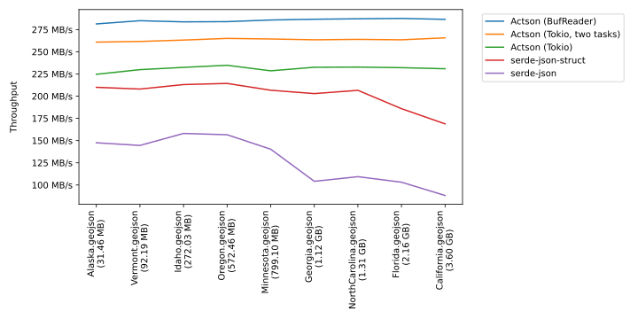
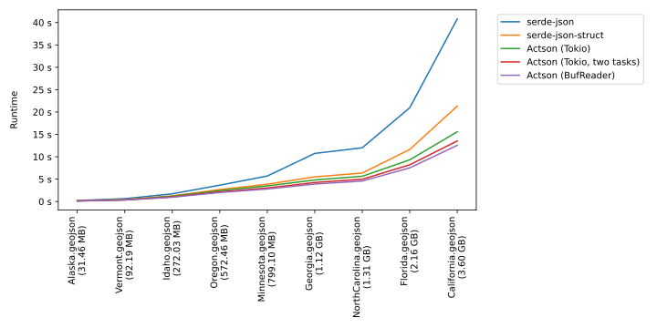

# GeoJSON benchmarks

> [!NOTE]
> For an interpretation of the benchmark results, read the [Performance](../README.md#performance) section in the main README.md file.

### Throughput (higher is better)



*Tested on a MacBook Pro 16" 2023 with an M3 Pro Chip and 36 GB of RAM.*

### Runtime (lower is better)



*Tested on a MacBook Pro 16" 2023 with an M3 Pro Chip and 36 GB of RAM.*

## Benchmarks

### actson-bufreader

Reads the input file with a `BufReader` and parses the read bytes with Actson.

### actson-tokio

Uses Tokio to asynchronously read the input file. Parses it with Actson.

### actson-tokio-twotasks

Uses two Tokio tasks: one that reads the file asynchronously and one that parses the read bytes with Actson. The tasks communicate with each other through a channel. This benchmark demonstrates how reading and parsing can happen concurrently.

### serde-value

Parses the JSON file with Serde JSON into a `Value`.

### serde-struct

Deserializes the JSON file with Serde JSON into a `struct`.

### serde-custom-deserializer

Uses a Serde JSON with a custom deserializer to avoid having to load the whole file into memory (see [example on the Serde website](https://serde.rs/stream-array.html)).

## Downloading the test data

The benchmarks automatically read every JSON file in the [`data`](data) directory.

To obtain the results above, we've used GeoJSON files from Microsoft Maps containing building footprints for the United States:
https://github.com/microsoft/USBuildingFootprints

These files have been released under the [Open Data Commons Open Database License (ODbL)](https://opendatacommons.org/licenses/odbl/).

You may use any file from this data set but to reproduce the results above, download the following files and extract them to the [`data`](data) directory:

| State or district | Number of buildings | Unzipped size |
|-------------------|---------------------|---------------|
| [Alaska](https://usbuildingdata.blob.core.windows.net/usbuildings-v2/Alaska.geojson.zip) | 111,042 | 31.46 MB |
| [California](https://usbuildingdata.blob.core.windows.net/usbuildings-v2/California.geojson.zip) | 11,542,912 | 3.60 GB |
| [Florida](https://usbuildingdata.blob.core.windows.net/usbuildings-v2/Florida.geojson.zip) | 7,263,195 | 2.16 GB |
| [Georgia](https://usbuildingdata.blob.core.windows.net/usbuildings-v2/Georgia.geojson.zip) | 3,981,792 | 1.12 GB |
| [Idaho](https://usbuildingdata.blob.core.windows.net/usbuildings-v2/Idaho.geojson.zip) | 942,132 | 272.03 MB |
| [Minnesota](https://usbuildingdata.blob.core.windows.net/usbuildings-v2/Minnesota.geojson.zip) | 2,914,016 | 799.10 MB |
| [North Carolina](https://usbuildingdata.blob.core.windows.net/usbuildings-v2/NorthCarolina.geojson.zip) | 4,678,064 | 1.31 GB |
| [Oregon](https://usbuildingdata.blob.core.windows.net/usbuildings-v2/Oregon.geojson.zip) | 1,873,786 | 572.46 MB |
| [Vermont](https://usbuildingdata.blob.core.windows.net/usbuildings-v2/Vermont.geojson.zip) | 351,266 | 92.19 MB |

For convenience, here's a script that downloads and extracts all files into the current working directory:

```shell
#!/usr/bin/env sh

wget https://usbuildingdata.blob.core.windows.net/usbuildings-v2/Alaska.geojson.zip
wget https://usbuildingdata.blob.core.windows.net/usbuildings-v2/California.geojson.zip
wget https://usbuildingdata.blob.core.windows.net/usbuildings-v2/Florida.geojson.zip
wget https://usbuildingdata.blob.core.windows.net/usbuildings-v2/Georgia.geojson.zip
wget https://usbuildingdata.blob.core.windows.net/usbuildings-v2/Idaho.geojson.zip
wget https://usbuildingdata.blob.core.windows.net/usbuildings-v2/Minnesota.geojson.zip
wget https://usbuildingdata.blob.core.windows.net/usbuildings-v2/NorthCarolina.geojson.zip
wget https://usbuildingdata.blob.core.windows.net/usbuildings-v2/Oregon.geojson.zip
wget https://usbuildingdata.blob.core.windows.net/usbuildings-v2/Vermont.geojson.zip

unzip Alaska.geojson.zip
unzip California.geojson.zip
unzip Florida.geojson.zip
unzip Georgia.geojson.zip
unzip Idaho.geojson.zip
unzip Minnesota.geojson.zip
unzip NorthCarolina.geojson.zip
unzip Oregon.geojson.zip
unzip Vermont.geojson.zip
```

## Running

In order to run the benchmarks, you need `hyperfine` installed on your system. Download it [here](https://github.com/sharkdp/hyperfine) if you do not have it already.

Execute the following script to run all benchmarks:

    ./run-all.sh

The command will run for about 40-45 minutes, depending on your system. It will write the result to [`results.json`](results.json). Open the provided Jupyter Notebook [`results.ipynb`](results.ipynb) to visualize them.
